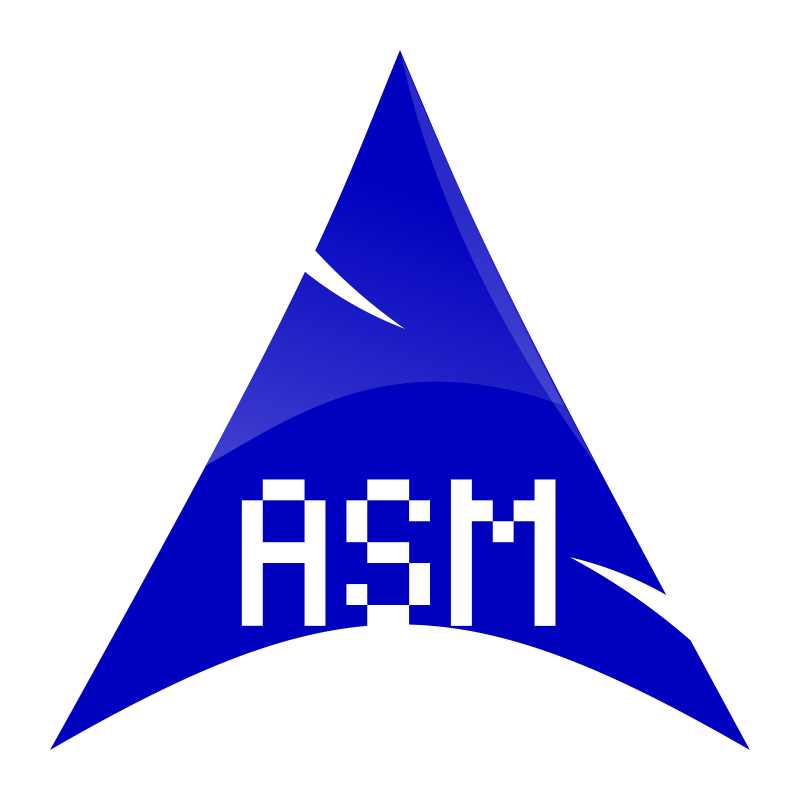

  <h1 class="title">Hi 👋, I'm Marius Rousset</h1>
  <h4 class="simple-line">I like to code what I need, discover new algorithms, and poke around what's hidden.</h4>
  <h4 class="simple-line">I'm currently studying at Epitech Paris in 3rd year.</h4>

   

  <h3 class="mid-title">Mastered Languages</h3>
  
  
  

  <h3 class="mid-title">Currently Learning</h3>
  

  <h3 class="mid-title">Other Languages and Tools</h3>
  

    
    
    
    
    
  

  
  

    
    
    
  

  

    
    
    
    
    
    
    
  

  
 

  

  <h3 class="mid-title">Connect with me</h3>
    

